# Demo
This demo shows how to use end-to-end encryption in Kafka

# Requirements
Before running this demo you should install java features for AES 256 bit. See [main readme](README.md)

# Installation
Firstly, check out all the dependencies:
git submodule init; git submodule update.
Run initialize_project.sh  

# Building
Run build_project.sh.  
After successful building run next command:  
./gradlew releaseTarGz -x signArchives  
The archives will be located at admin/build/distributions, kafka/core/build/distributions and examples/build/distributions folders.  
Unpack admin, kafka and examples archives.  
Export environment variables ADMIN_HOME, KAFKA_HOME and EXAMPLES_HOME for result folders.  
Export environment variable KEYS_DIR for folder with keys.  

# Administration console
Administrator console is used to manage channels (topics) and re-encryption keys for Kafka broker.  
See [readme.](admin/README.md)    

# Security configuration
To use end-to-end encryption in Kafka, you should setup SASL for ZooKeeper connections and also for Kafka security.  
Full instructions are available at links:  
https://cwiki.apache.org/confluence/display/ZOOKEEPER/Zookeeper+and+SASL  
https://kafka.apache.org/documentation/#security

# Kafka NuCypher configuration
nucypher.reencryption.keys.path - root path in ZooKeeper where re-encryption keys are stored  
nucypher.cache.reencryption.keys.capacity - re-encryption keys cache capacity, default 100000  
nucypher.cache.reencryption.keys.granular.capacity - granular re-encryption keys cache capacity, default 1000000  
nucypher.cache.edek.capacity - EDEK cache capacity, default 1000000  
nucypher.cache.channels.capacity - channels cache capacity, default 1000  

# Prepared configuration for the demonstration  
Configuration files for starting ZooKeeper and Kafka servers with plain SASL are prepared in the repository (kafka/config):  
* zookeeper_server_jaas.conf - JAAS configuration for ZooKeeper server  
* zookeeper-nucypher.properties - ZooKeeper configuration with configured SASL provider  
* kafka_server_jaas.conf - JAAS configuration for Kafka brokers  
* server-nucypher.properties - Kafka configuration with configured SASL authentication and root path of re-encryption keys (/keys)  

Configuration files for using administration console ($ADMIN_HOME/config-example):  
* config.properties - console configuration with configured users and re-encryption keys path (/keys/admin)  
* jaas.conf - JAAS configuration for console  

JAAS configuration has 4 users:  
* kafka - Kafka - ZooKeeper user  
* admin - user for administration console  
* broker - user for connecting Kafka brokers together  
* alice - user for Kafka consumers and producers  

# Topics
There are 3 types of topics:  
* simple topic - no special message processing on broker side  
* topic with full encryption - each message is fully encrypted with one EDEK and one private key, Kafka broker re-encrypts EDEK using master key  
* topic with granular encryption - each message is encrypted by fields (currently only JSON format) with different EDEKs and one private key. Kafka broker re-encrypts each EDEK using derived key  

# Examples of clients
The repository has examples of Kafka clients to send unencrypted or encrypted messages (examples project).  
This examples use JAAS configuration file which located at 'examples/src/main/resources/jaas.conf'  
* Producer - com.nucypher.kafka.clients.example.general.StringProducer  
```
Usage: <type> <topic> <message> [<public key> [<field>...]]
<type> - type. NON, FULL, GRANULAR
<topic> - topic/channel name
<message> - message
<public key> - public key path (for full and partial types)
<field>... - field names for granular encryption (for granular type)
```
* Consumer - com.nucypher.kafka.clients.example.general.StringConsumer  
```
Usage: <type> <topic> [<private key>]
<type> - type. NON, FULL, GRANULAR
<topic> - topic/channel name
<private key> - private key path (for full and granular types)
```

# Type of re-encryption keys
There are several types of re-encryption keys:  
* Re-encryption key which derived from private master key and private client key. Used for producer or consumer with full encryption
* Re-encryption key which derived from private master key and public client key. Used only for consumer with full encryption
* Re-encryption key which derived from private master key, field name and private client key. Used for producer or consumer with granular encryption
* Re-encryption key which derived from private master key, field name and public client key. Used only for consumer with granular encryption
* Empty re-encryption key (without re-encryption for encrypted topics). Used to send messages from producer using master private key and also used to copy messages without re-encryption

# EC keys generation
For generating EC key pairs you may use openssl:  
`openssl ecparam -name secp521r1 -genkey -param_enc explicit -out private-key.pem`  
or administration console:  
`$ADMIN_HOME/bin/nucypher-kafka-admin --generate
 --private-key private-key.pem --public-key public-key.pem --curve-name secp521r1`  

# Demonstration
# Starting ZooKeeper and Kafka
* Start local ZooKeeper server using prepared configuration:  
```
export EXTRA_ARGS=-Djava.security.auth.login.config=$KAFKA_HOME/config/zookeeper_server_jaas.conf
$KAFKA_HOME/bin/zookeeper-server-start.sh $KAFKA_HOME/config/zookeeper-nucypher.properties
```

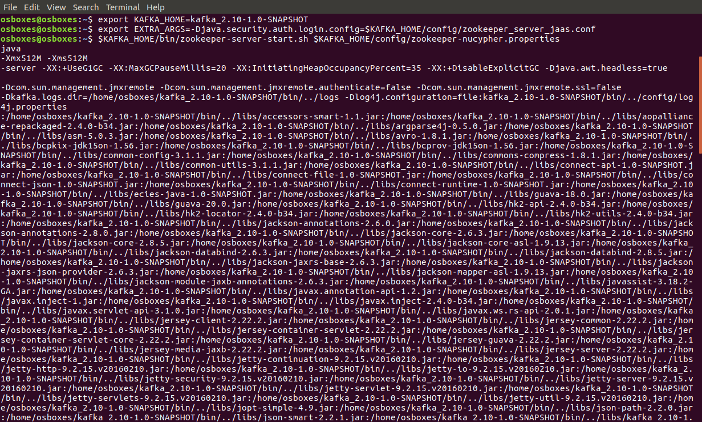

* Start Kafka broker using prepared configuration:  
```
export KAFKA_OPTS=-Djava.security.auth.login.config=$KAFKA_HOME/config/kafka_server_jaas.conf
$KAFKA_HOME/bin/kafka-server-start.sh $KAFKA_HOME/config/server-nucypher.properties
```

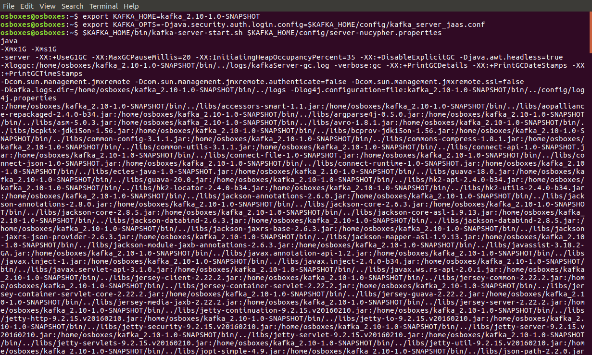

## EC keys generation
Generate 3 key pairs:  
`mkdir keys`  
`$ADMIN_HOME/bin/nucypher-kafka-admin --generate --private-key $KEYS_DIR/master-private-key.pem --public-key $KEYS_DIR/master-public-key.pem --curve-name secp521r1`  
`$ADMIN_HOME/bin/nucypher-kafka-admin --generate --private-key $KEYS_DIR/producer-private-key.pem --public-key $KEYS_DIR/producer-public-key.pem --curve-name secp521r1`  
`$ADMIN_HOME/bin/nucypher-kafka-admin --generate --private-key $KEYS_DIR/consumer-private-key.pem --public-key $KEYS_DIR/consumer-public-key.pem --curve-name secp521r1`  

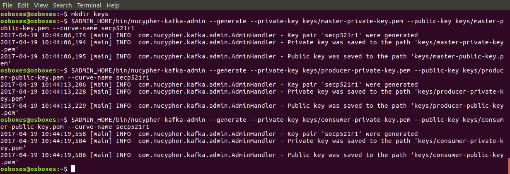

## Simple topic without re-encryption
* Send and receive unencrypted message  
`java -cp $EXAMPLES_HOME/nucypher-kafka-examples-1.0-SNAPSHOT.jar com.nucypher.kafka.clients.example.general.StringProducer non simple '{"a":[false,true],"b":{"b":10},"c":"c","d":null,"e":{"e":{"e":[{"e":"e"}]}},"z":"z"}'`  
`java -cp $EXAMPLES_HOME/nucypher-kafka-examples-1.0-SNAPSHOT.jar com.nucypher.kafka.clients.example.general.StringConsumer non simple`  
* Send and receive fully encrypted message using master keys   
`java -cp $EXAMPLES_HOME/nucypher-kafka-examples-1.0-SNAPSHOT.jar com.nucypher.kafka.clients.example.general.StringProducer full full '{"a":[false,true],"b":{"b":10},"c":"c","d":null,"e":{"e":{"e":[{"e":"e"}]}},"z":"z"}' $KEYS_DIR/master-public-key.pem`  
`java -cp $EXAMPLES_HOME/nucypher-kafka-examples-1.0-SNAPSHOT.jar com.nucypher.kafka.clients.example.general.StringConsumer full full $KEYS_DIR/master-private-key.pem`  
* Send and receive granular encrypted message with certain fields using master keys   
`java -cp $EXAMPLES_HOME/nucypher-kafka-examples-1.0-SNAPSHOT.jar com.nucypher.kafka.clients.example.general.StringProducer granular granular '{"a":[false,true],"b":{"b":10},"c":"c","d":null,"e":{"e":{"e":[{"e":"e"}]}},"z":"z"}' $KEYS_DIR/master-public-key.pem a.1 b.b c d e.e.e.1`  
`java -cp $EXAMPLES_HOME/nucypher-kafka-examples-1.0-SNAPSHOT.jar com.nucypher.kafka.clients.example.general.StringConsumer granular granular $KEYS_DIR/master-private-key.pem`  


## Topic with full encryption
### Full re-encryption using private keys
* Export environment variable  
`export JAVA_OPTS=-Djava.security.auth.login.config=$ADMIN_HOME/config-example/jaas.conf`  
* Create 'full' channel for re-encryption keys in ZooKeeper using administration console  
`$ADMIN_HOME/bin/nucypher-kafka-admin --config $ADMIN_HOME/config-example/config.properties 
--add-channel --channel full --channel-type full`  
* Create re-encryption key for producer    
`$ADMIN_HOME/bin/nucypher-kafka-admin --config $ADMIN_HOME/config-example/config.properties
--add-key --master-key $KEYS_DIR/master-private-key.pem --client-key $KEYS_DIR/producer-private-key.pem 
--client-type producer --client-name alice --channel full --days 365`  
* Create re-encryption key for consumer    
`$ADMIN_HOME/bin/nucypher-kafka-admin --config $ADMIN_HOME/config-example/config.properties
--add-key --master-key $KEYS_DIR/master-private-key.pem --client-key $KEYS_DIR/consumer-private-key.pem 
--client-type consumer --client-name alice --channel full --days 365`  
* Send fully encrypted message using producer public key  
`java -cp $EXAMPLES_HOME/nucypher-kafka-examples-1.0-SNAPSHOT.jar
com.nucypher.kafka.clients.example.general.StringProducer full full
'{"a":[false,true],"b":{"b":10},"c":"c","d":null,"e":{"e":{"e":[{"e":"e"}]}},"z":"z"}' 
$KEYS_DIR/producer-public-key.pem`  
* Receive fully encrypted message using consumer private key  
`java -cp $EXAMPLES_HOME/nucypher-kafka-examples-1.0-SNAPSHOT.jar 
com.nucypher.kafka.clients.example.general.StringConsumer full full 
$KEYS_DIR/consumer-private-key.pem`  

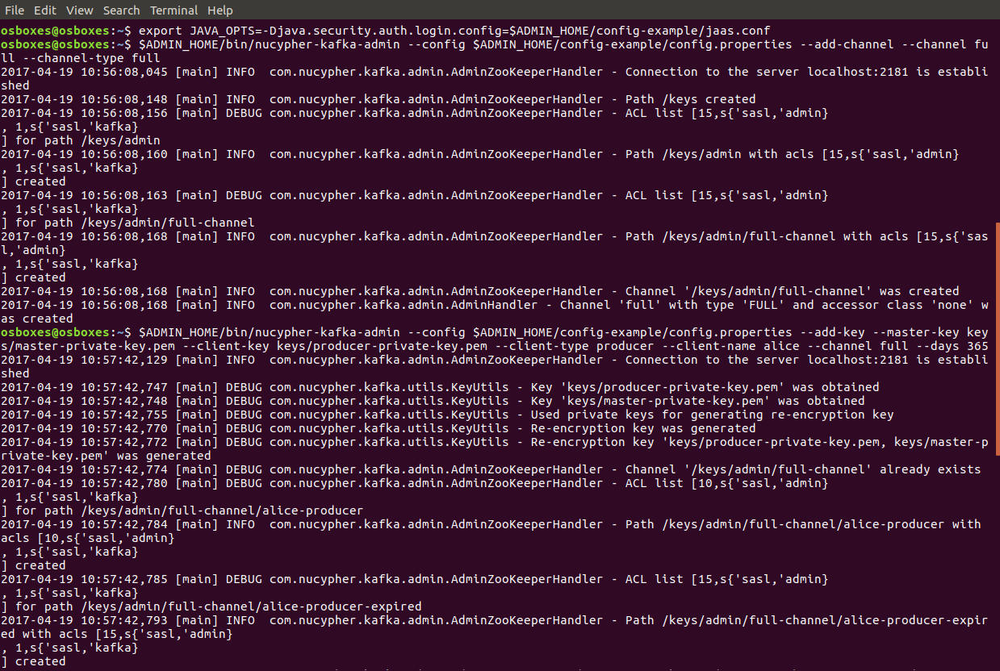


### Full re-encryption using private and public keys
* Export environment variable  
`export JAVA_OPTS=-Djava.security.auth.login.config=$ADMIN_HOME/config-example/jaas.conf`  
* Create 'full2' channel and empty re-encryption key for producer    
`$ADMIN_HOME/bin/nucypher-kafka-admin --config $ADMIN_HOME/config-example/config.properties
--add-key --client-type producer --client-name alice --channel full2`  
* Create re-encryption key for consumer    
`$ADMIN_HOME/bin/nucypher-kafka-admin --config $ADMIN_HOME/config-example/config.properties
--add-key --master-key $KEYS_DIR/master-private-key.pem --client-key $KEYS_DIR/consumer-public-key.pem 
--client-type consumer --client-name alice --channel full2 --days 365`  
* Send fully encrypted message using master public key  
`java -cp $EXAMPLES_HOME/nucypher-kafka-examples-1.0-SNAPSHOT.jar 
com.nucypher.kafka.clients.example.general.StringProducer full full2 
'{"a":[false,true],"b":{"b":10},"c":"c","d":null,"e":{"e":{"e":[{"e":"e"}]}},"z":"z"}' 
$KEYS_DIR/master-public-key.pem`  
* Receive fully encrypted message using consumer private key  
`java -cp $EXAMPLES_HOME/nucypher-kafka-examples-1.0-SNAPSHOT.jar 
com.nucypher.kafka.clients.example.general.StringConsumer full full2 
$KEYS_DIR/consumer-private-key.pem`  


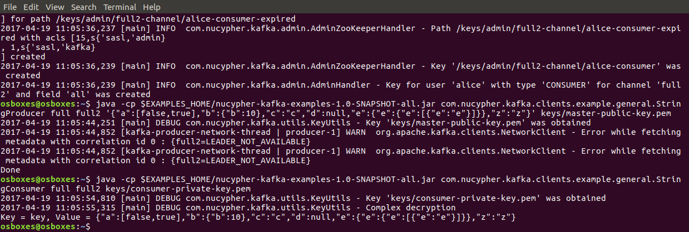

### Without re-encryption
* Export environment variable  
`export JAVA_OPTS=-Djava.security.auth.login.config=$ADMIN_HOME/config-example/jaas.conf`  
* Create 'full3' channel and empty re-encryption key for producer    
`$ADMIN_HOME/bin/nucypher-kafka-admin --config $ADMIN_HOME/config-example/config.properties 
--add-key --client-type producer --client-name alice --channel full3`  
* Create empty re-encryption key for consumer    
`$ADMIN_HOME/bin/nucypher-kafka-admin --config $ADMIN_HOME/config-example/config.properties 
--add-key --client-type consumer --client-name alice --channel full3`  
* Send fully encrypted message using master public key  
`java -cp $EXAMPLES_HOME/nucypher-kafka-examples-1.0-SNAPSHOT.jar 
com.nucypher.kafka.clients.example.general.StringProducer full full3 
'{"a":[false,true],"b":{"b":10},"c":"c","d":null,"e":{"e":{"e":[{"e":"e"}]}},"z":"z"}' 
$KEYS_DIR/master-public-key.pem`  
* Receive fully encrypted message without decryption  
`java -cp $EXAMPLES_HOME/nucypher-kafka-examples-1.0-SNAPSHOT.jar 
com.nucypher.kafka.clients.example.general.StringConsumer non full3`  


## Topic with granular encryption
### Granular re-encryption using private keys
* Export environment variable  
`export JAVA_OPTS=-Djava.security.auth.login.config=$ADMIN_HOME/config-example/jaas.conf` 
* Create 'granular' channel for re-encryption keys in ZooKeeper using administration console  
`$ADMIN_HOME/bin/nucypher-kafka-admin --config $ADMIN_HOME/config-example/config.properties --add-channel
--channel granular --channel-type granular 
--channel-data-format json`  
* Create re-encryption key using certain fields for producer  
`$ADMIN_HOME/bin/nucypher-kafka-admin --config $ADMIN_HOME/config-example/config.properties 
--add-key --master-key $KEYS_DIR/master-private-key.pem --client-key $KEYS_DIR/producer-private-key.pem 
--client-type producer --client-name alice --channel granular --days 365 
--field a.1 --field b.b --field c --field d --field e.e.e.1`  
* Create re-encryption key using some fields for consumer    
`$ADMIN_HOME/bin/nucypher-kafka-admin --config $ADMIN_HOME/config-example/config.properties 
--add-key --master-key $KEYS_DIR/master-private-key.pem --client-key $KEYS_DIR/consumer-private-key.pem 
--client-type consumer --client-name alice --channel granular --days 365 
--field a.1 --field b.b --field d --field e.e.e.1`  
* Send granular encrypted message with certain fields using producer public key  
`java -cp $EXAMPLES_HOME/nucypher-kafka-examples-1.0-SNAPSHOT.jar 
com.nucypher.kafka.clients.example.general.StringProducer granular granular 
'{"a":[false,true],"b":{"b":10},"c":"c","d":null,"e":{"e":{"e":[{"e":"e"}]}},"z":"z"}' 
$KEYS_DIR/producer-public-key.pem 
a.1 b.b c d e.e.e.1`  
* Receive granular encrypted message using consumer private key  
`java -cp $EXAMPLES_HOME/nucypher-kafka-examples-1.0-SNAPSHOT.jar 
com.nucypher.kafka.clients.example.general.StringConsumer granular granular 
$KEYS_DIR/consumer-private-key.pem`  

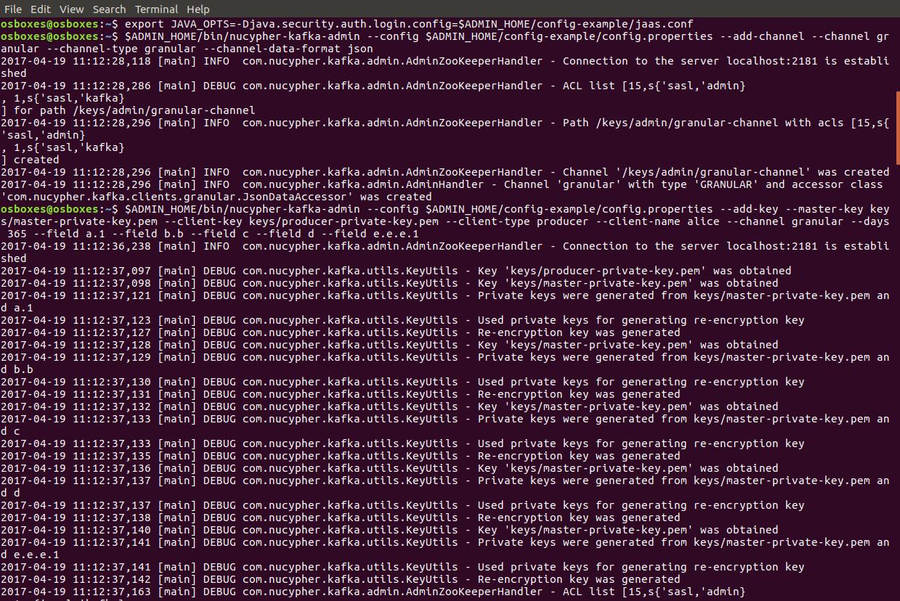

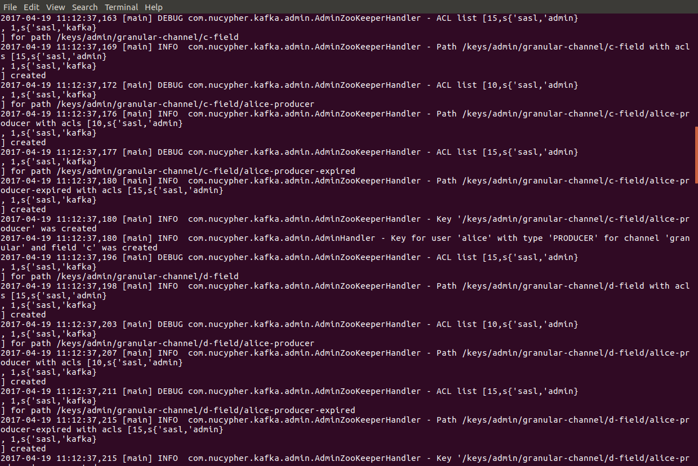

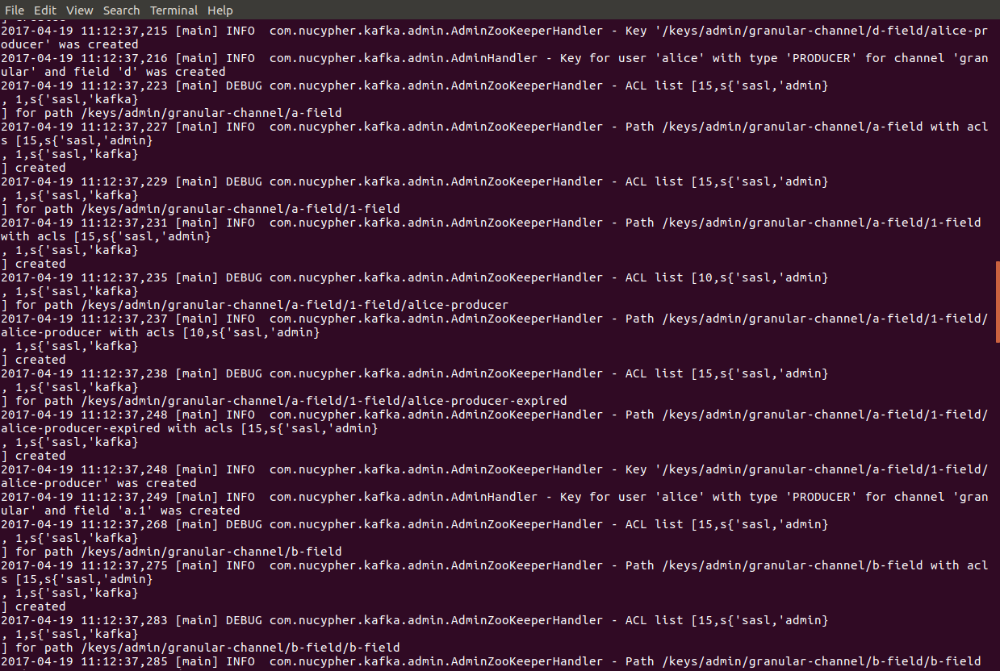

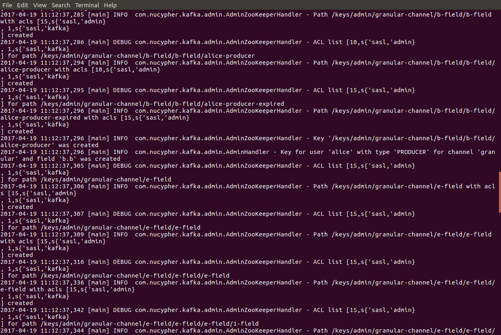


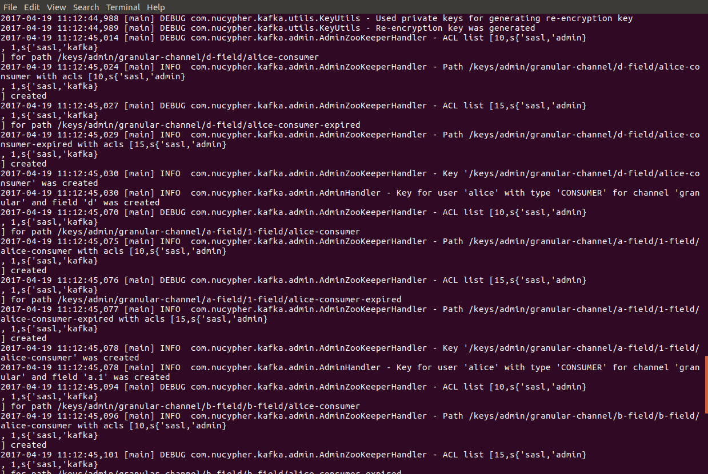

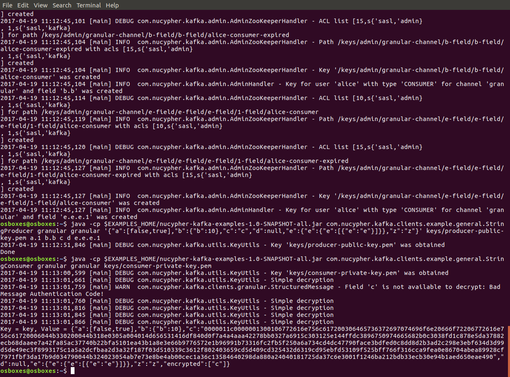

### Granular re-encryption using private and public keys
* Export environment variable  
`export JAVA_OPTS=-Djava.security.auth.login.config=$ADMIN_HOME/config-example/jaas.conf`  
* Create 'granular' channel and empty re-encryption key using certain fields for producer  
`$ADMIN_HOME/bin/nucypher-kafka-admin --config $ADMIN_HOME/config-example/config.properties 
--add-key --master-key $KEYS_DIR/master-private-key.pem --client-key $KEYS_DIR/master-private-key.pem 
--client-type producer --client-name alice --channel granular2 
--field a.1 --field b.b --field c --field d --field e.e.e.1 
--channel-data-format json`  
* Create re-encryption key using some fields for consumer    
`$ADMIN_HOME/bin/nucypher-kafka-admin --config $ADMIN_HOME/config-example/config.properties 
--add-key --master-key $KEYS_DIR/master-private-key.pem --client-key $KEYS_DIR/consumer-public-key.pem 
--client-type consumer --client-name alice --channel granular2 --days 365 
--field a.1 --field b.b --field d --field e.e.e.1`  
* Send granular encrypted message with certain fields using master public key  
`java -cp $EXAMPLES_HOME/nucypher-kafka-examples-1.0-SNAPSHOT.jar 
com.nucypher.kafka.clients.example.general.StringProducer granular granular2 
'{"a":[false,true],"b":{"b":10},"c":"c","d":null,"e":{"e":{"e":[{"e":"e"}]}},"z":"z"}' 
$KEYS_DIR/master-public-key.pem 
a.1 b.b c d e.e.e.1`  
* Receive granular encrypted message using consumer private key  
`java -cp $EXAMPLES_HOME/nucypher-kafka-examples-1.0-SNAPSHOT.jar 
com.nucypher.kafka.clients.example.general.StringConsumer granular granular2 
$KEYS_DIR/consumer-private-key.pem`  

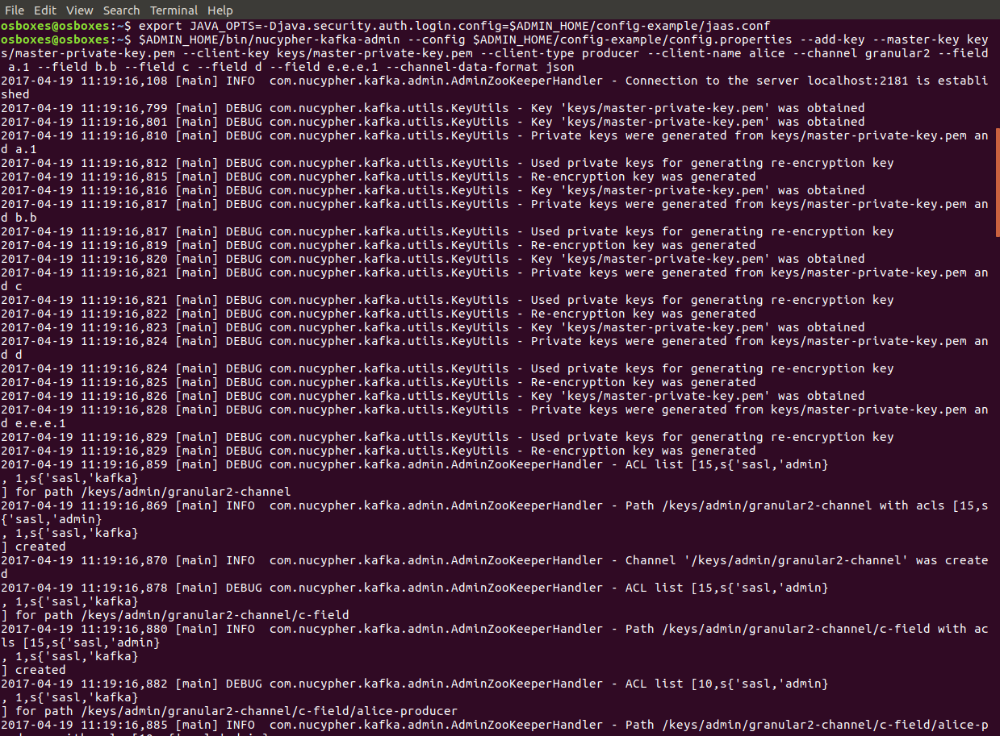

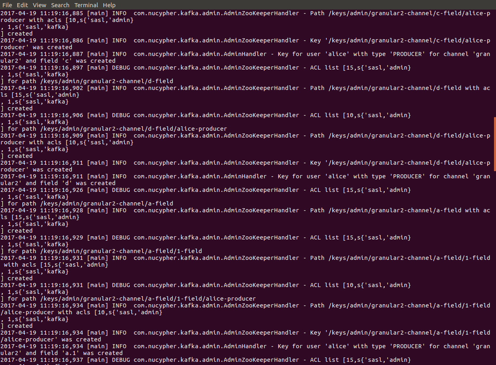


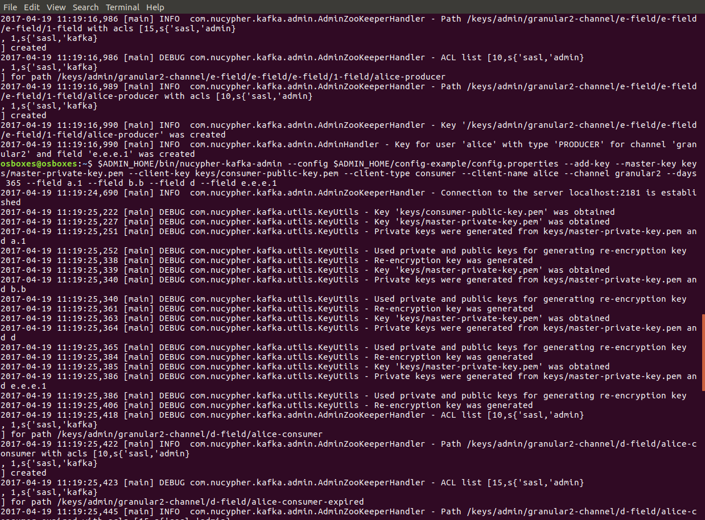


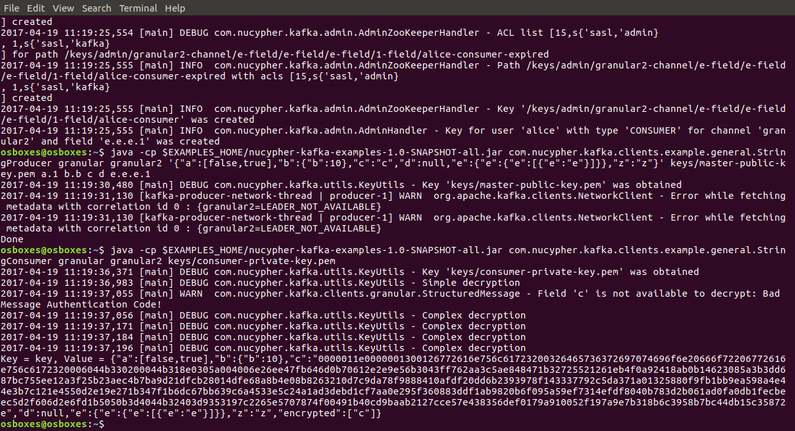
